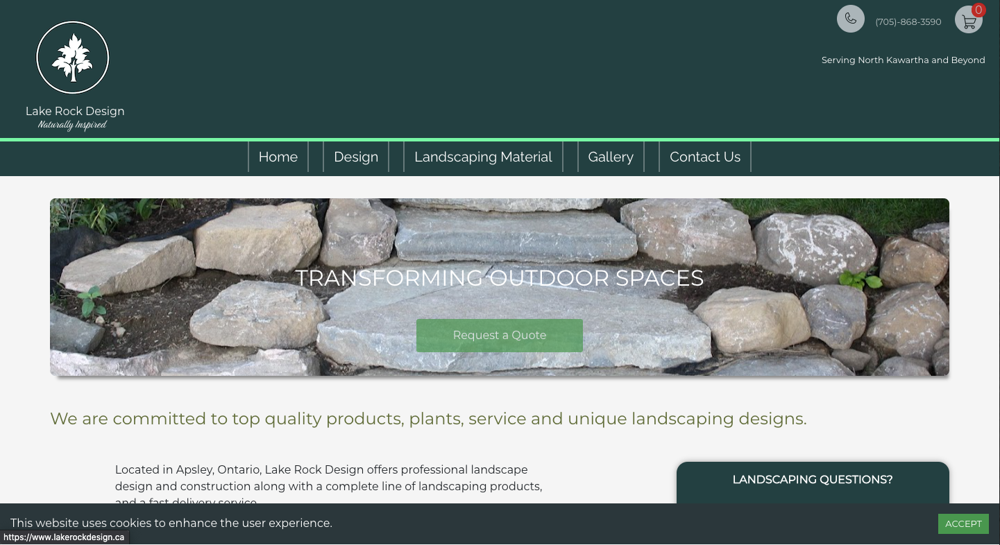
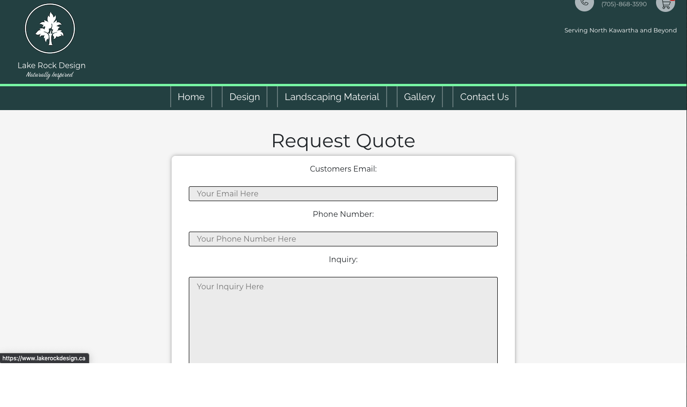
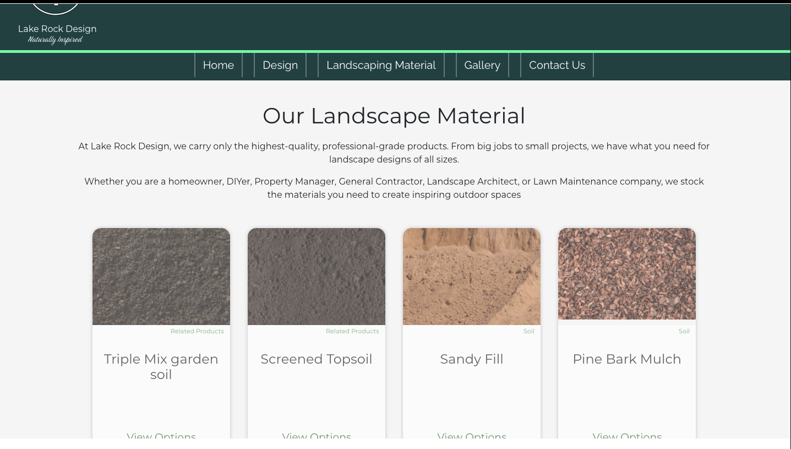
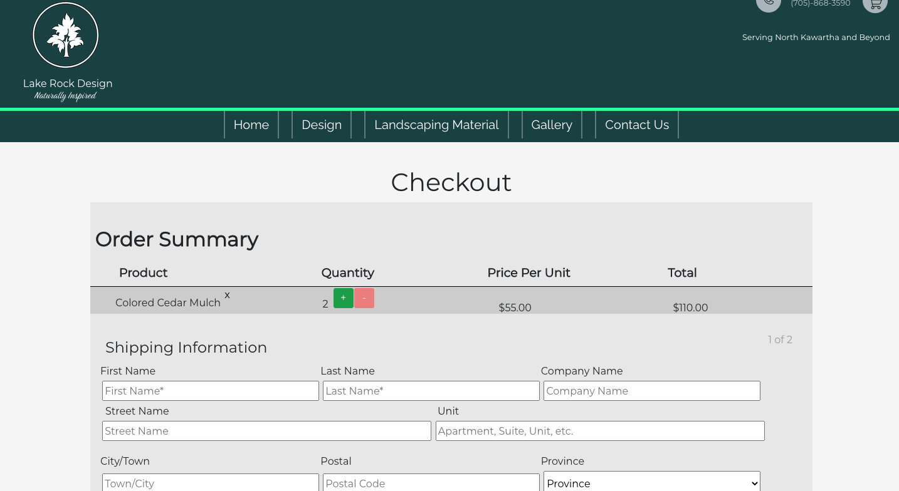

# Lake Rock Design - backend
the backend for an E-Commerce and Professional website for a Landscaping and Landscaping supply Company based in Central Ontario.
## Live

  [www.lakerockdesign.ca/](https://www.lakerockdesign.ca/)
## Screenshots
#### Screenshot of Homepage

#### Screenshot of Requesting a Quote

#### Screenshot of Store Page

#### Screenshot of Item Page

#### Screenshot of Checkout

## Tech Stack
* Front-End: HTML, CSS, React, Bootstrap.

* Back-end: Ruby on Rails API, Postgres.

<!-- * Testing: Jest, Storybook, and Cypress. -->

## Setup

* Install dependencies with `Bundle Install`.
* run `rails db:setup` or `rails db:create`, `rails db:migrate`, `rails db:seed`
* Fork & Install dependencies for frontend [here](https://github.com/kylemcloughlin/dulder)
* Run `rails s -p 3001` - Backend
* Run `npm start` - Frontend

## Dependencies
  *  ruby -  ^2.7.2
  *  rails - ~> 6.0.3 >= 6.0.3.5
  *  pg - >= 0.18 < 2.0
  *  rack-cors
  *  stripe
  *  byebugn

